# Домашнее задание к занятию 1 «Введение в Ansible»

## Структура проекта
```
hw01/
├── docker
│   └── docker-compose.yml
├── images
├── playbook
│   ├── group_vars
│   │   ├── all
│   │   │   └── examp.yml
│   │   ├── deb
│   │   │   └── examp.yml
│   │   ├── el
│   │   │   └── examp.yml
│   │   └── fedora
│   │       └── examp.yml
│   ├── inventory
│   │   ├── prod.yml
│   │   └── test.yml
│   └── site.yml
├── README.md
└── scripts
    └── run_lab.sh
```

## Ответы на задания

### 1. Запуск playbook на test.yml
**Команда:**  
`ansible-playbook -i inventory/test.yml site.yml`  
**Значение some_fact:** `12` 
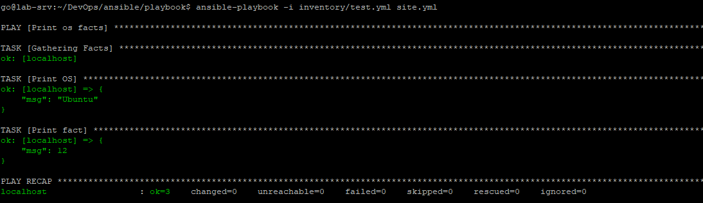

### 2. Файл с переменными и изменение значения
Файл: [group_vars/all/examp.yml](playbook/group_vars/all/examp.yml)
Новое значение: `all default fact`
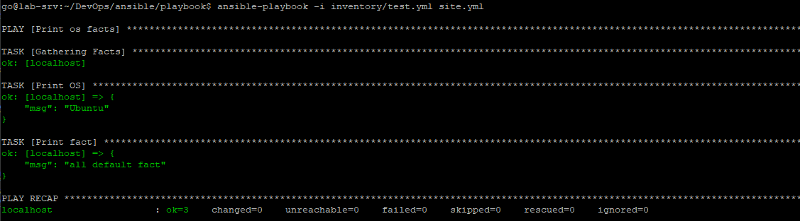

### 3. Подготовка окружения
Использованы Docker-контейнеры:
- `pycontribs/ubuntu:latest` для deb-подобных систем
- `pycontribs/centos:7` для el-подобных систем

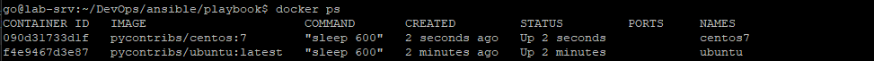

### 4. Запуск на prod.yml до добавления групповых переменных
Значения `some_fact:`
- ubuntu: `deb`
- centos7: `el`

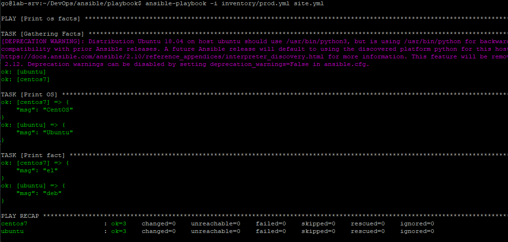

### 5. Добавление фактов в group_vars/deb и group_vars/el
- `group_vars/deb/examp.yml`: `some_fact: "deb default fact"`
- `group_vars/el/examp.yml`: `some_fact: "el default fact"`


### 6. Повторный запуск на prod.yml
- ubuntu: `deb default fact`
- centos7: `el default fact`

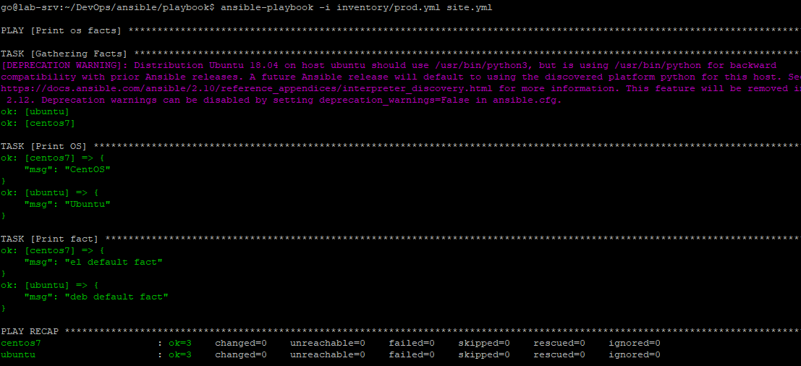

### 7. Шифрование файлов
Зашифрованы файлы [group_vars/deb/examp.yml](playbook/group_vars/deb/examp.yml) и [group_vars/el/examp.yml](playbook/group_vars/el/examp.yml) с паролем `netology`.

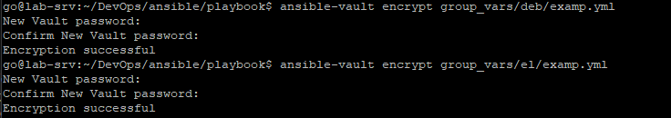


### 8. Запуск с запросом пароля
Использована опция `--ask-vault-pass`, пароль введён успешно, playbook отработал корректно.

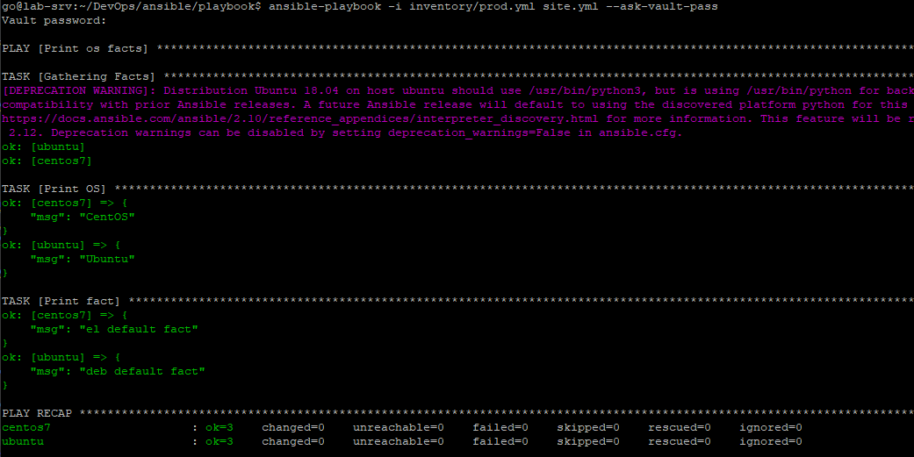

### 9. Плагин подключения для control node
Подходящий плагин: `local`. Используется для подключения к `localhost` на (Control Node).

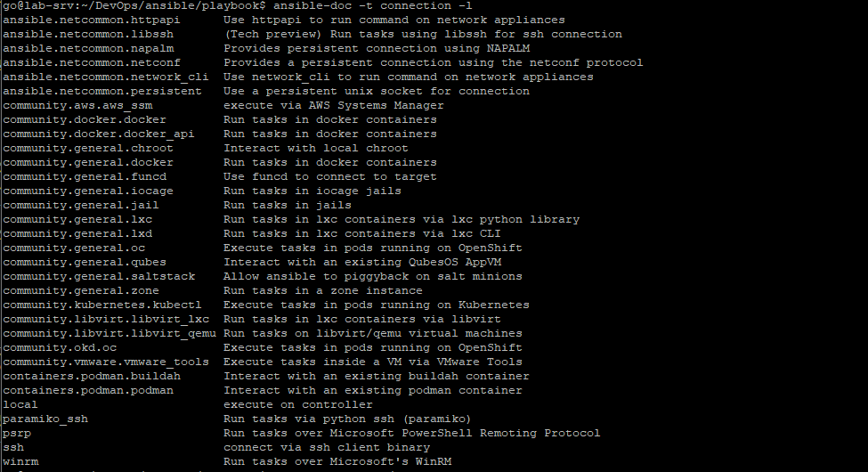

### 10. Добавление группы local в inventory/prod.yml
Добавлен хост `localhost` с `ansible_connection: local`.


### 11. Финальный запуск playbook
Значения some_fact:
- ubuntu: `deb default fact`
- centos7: `el default fact`
- localhost: `all default fact`

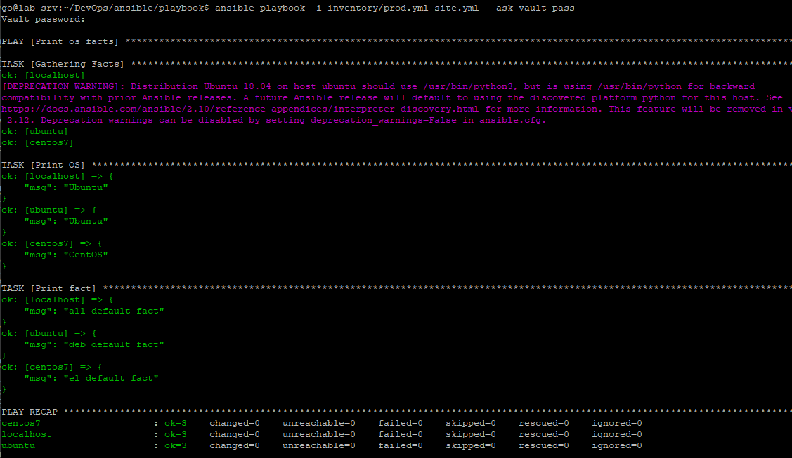

## Необязательная часть

### 1. Расшифровка файлов:
`ansible-vault decrypt group_vars/deb/examp.yml group_vars/el/examp.yml --ask-vault-pass`

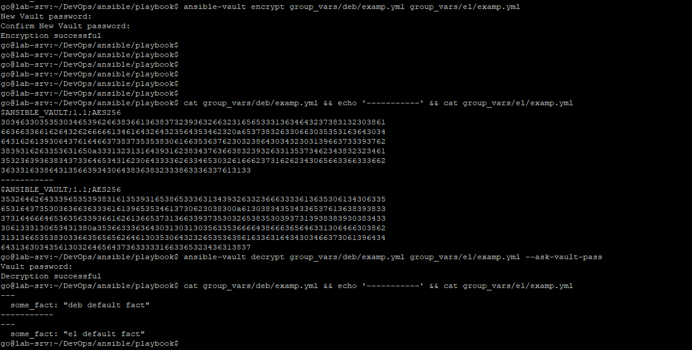

### 2. Шифрование отдельного значения:
`ansible-vault encrypt_string --name 'some_fact' 'PaSSw0rd'`

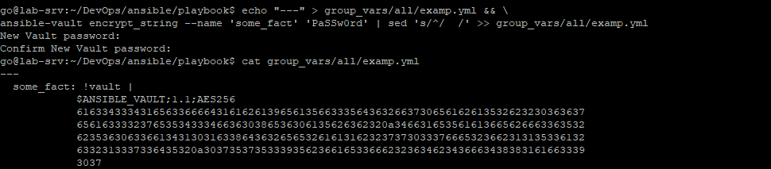

### 3. Запуск playbook и проверка нового факта
`ansible-playbook -i inventory/prod.yml site.yml --ask-vault-pass`

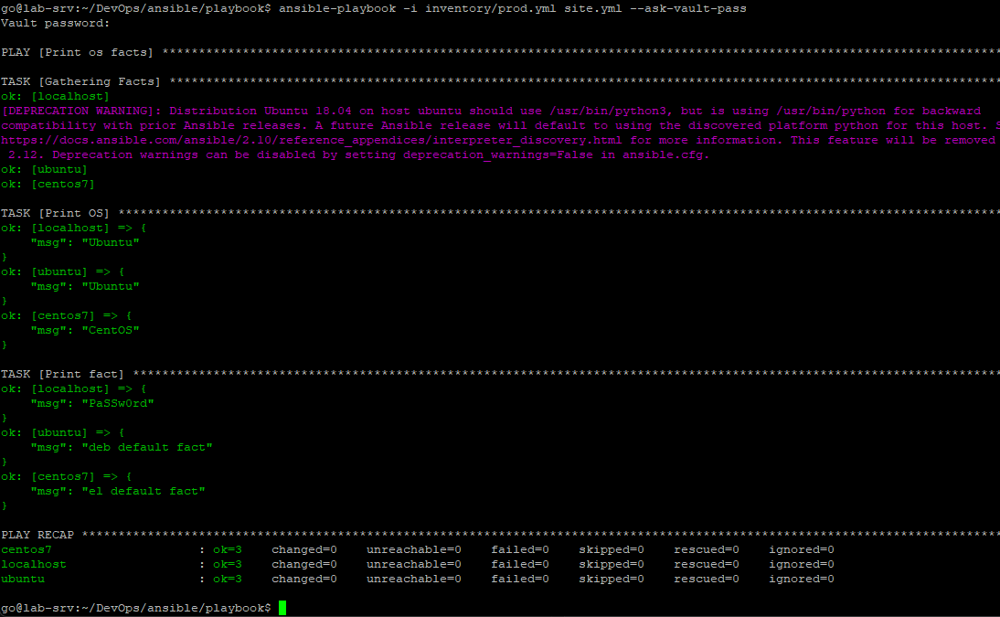

### 4. Добавление новой группы хостов fedora

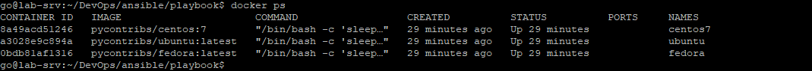

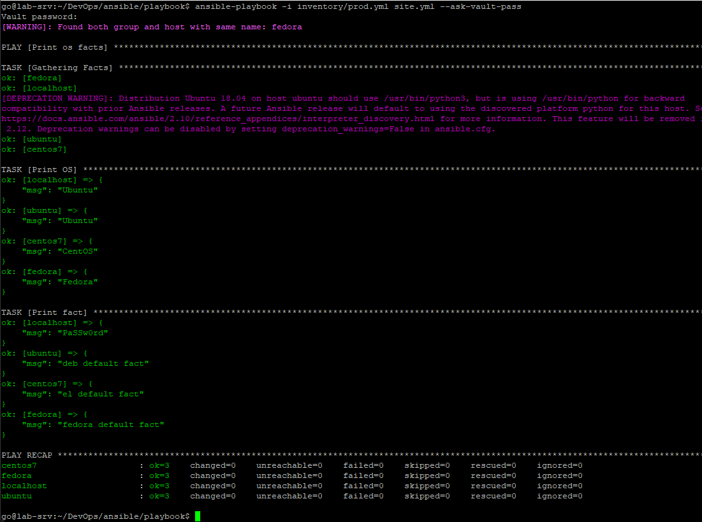

### 5. Скрипт на bash для автоматизации поднятия контейнеров, запуска playbook и остановки контейнеров.
- [Bash-script](scripts/run_lab.sh)
