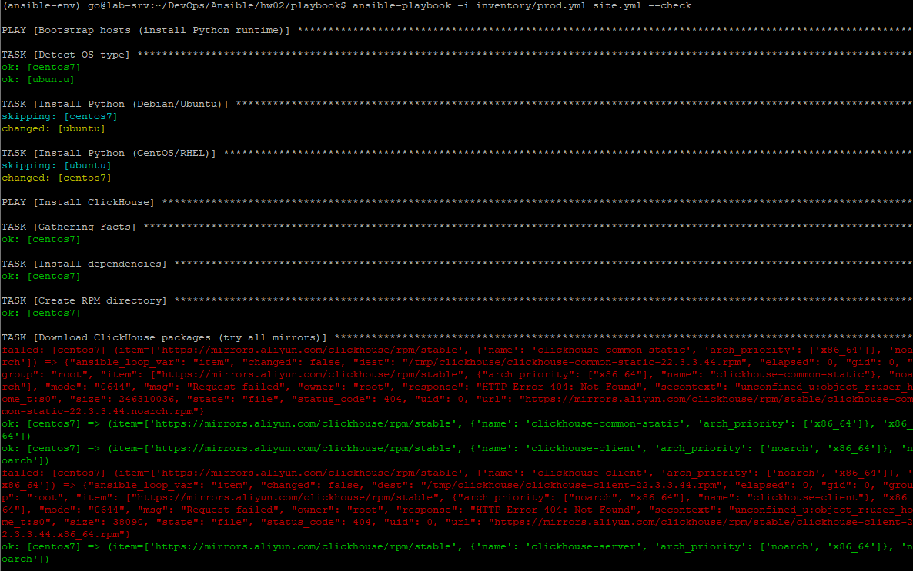
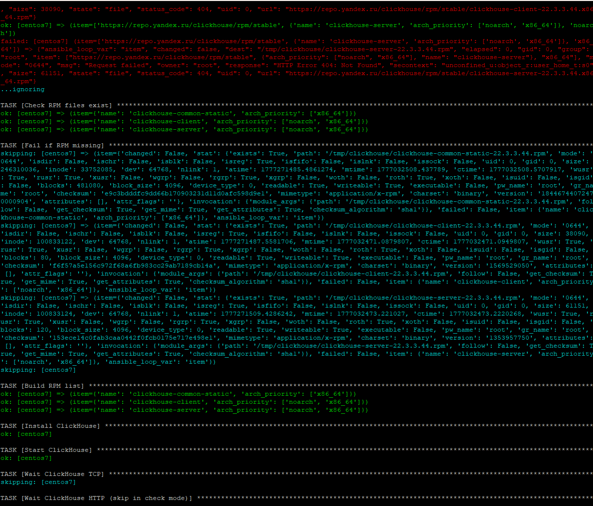
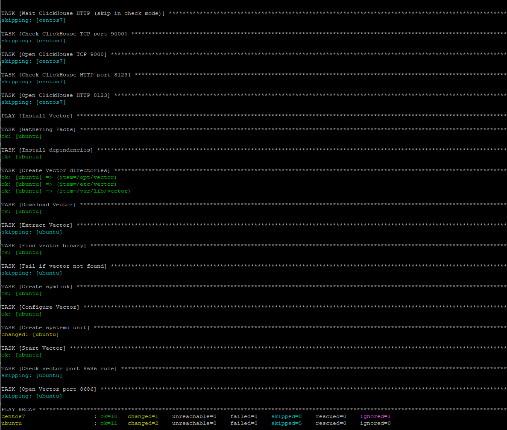
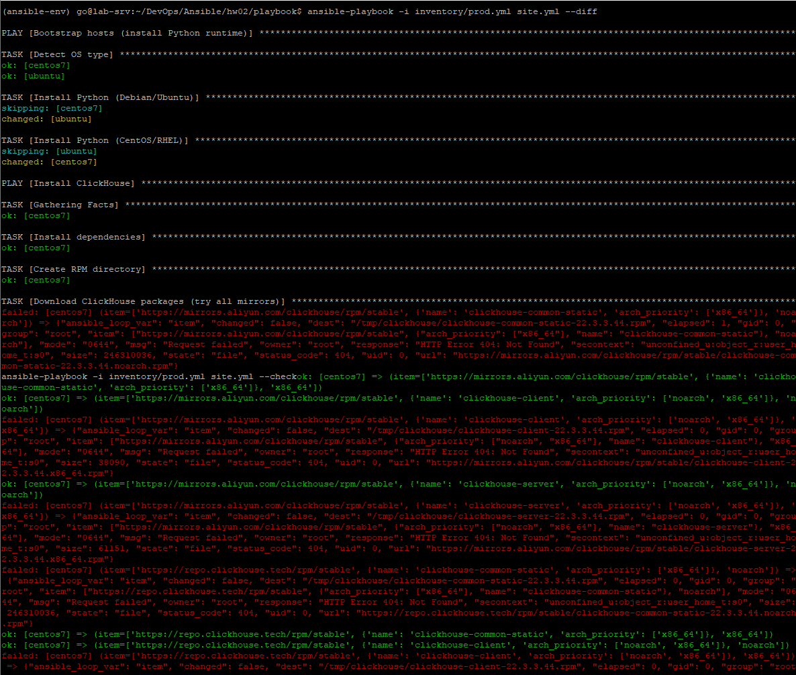
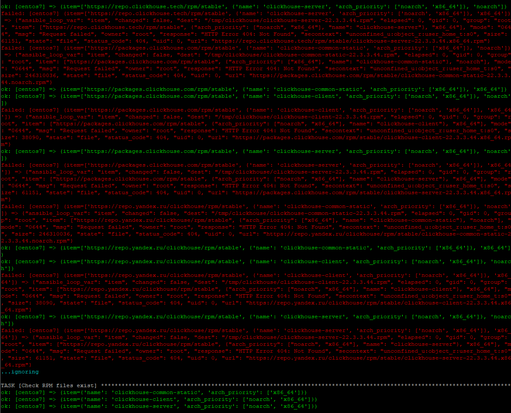
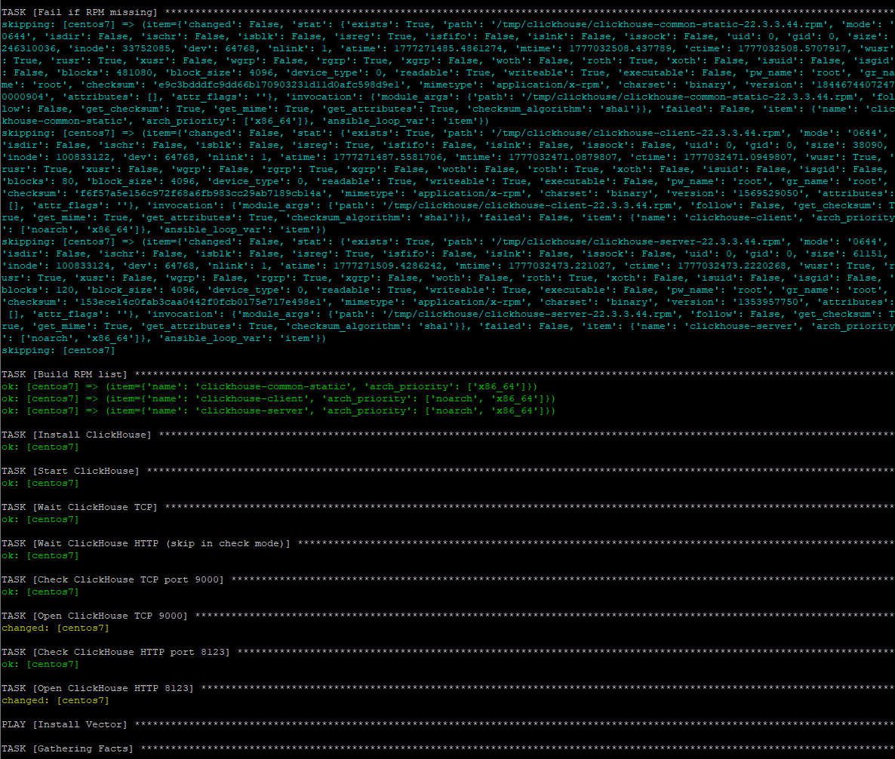
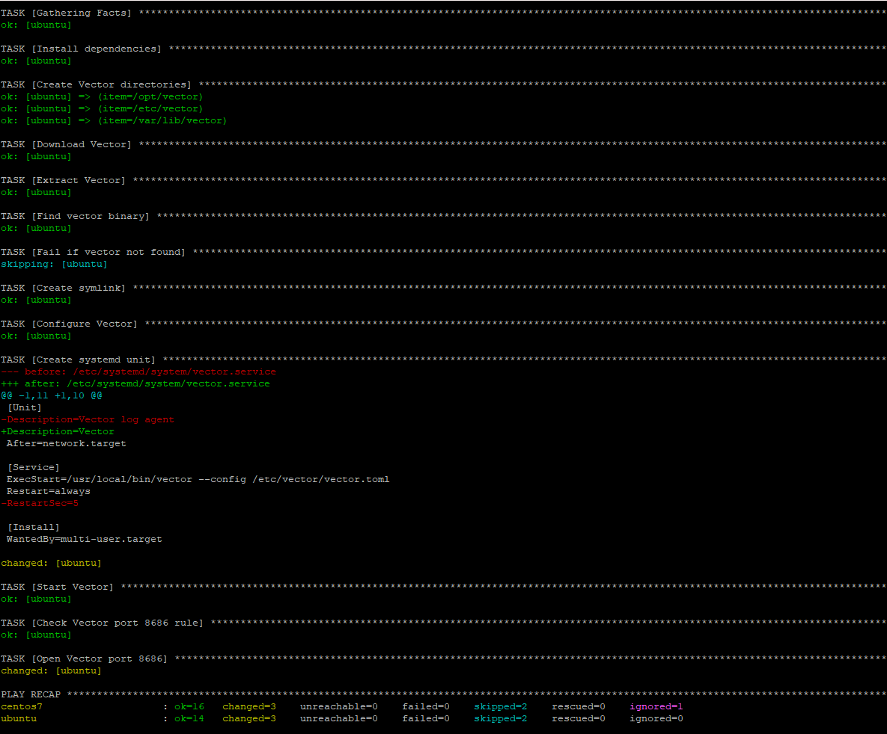
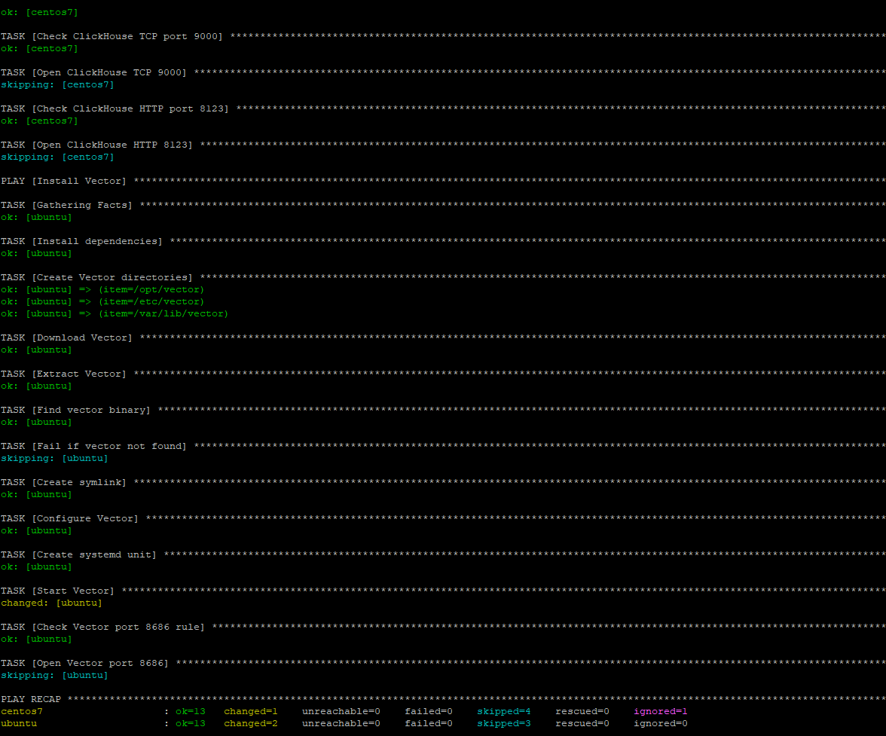

# Домашнее задание к занятию 2 «Работа с Playbook»

# 🚀 Ansible Playbook: ClickHouse + Vector Deployment

## 📌 Описание проекта

Данный Ansible playbook предназначен для автоматизированного развертывания:

- 🗄 ClickHouse (аналитическая СУБД)
- 📊 Vector (сборщик логов и телеметрии)

Поддерживаемые ОС:
- CentOS 7 (ClickHouse)
- Ubuntu 22/24 (Vector)

---

## ⚙️ Архитектура

Playbook состоит из 3 этапов:

### 1. Bootstrap
- Установка Python на удалённые хосты
- Определение типа ОС (Debian / RedHat)
- Подготовка системы для работы Ansible

### 2. ClickHouse deployment
- Установка зависимостей
- Загрузка RPM пакетов с fallback mirror
- Установка ClickHouse
- Настройка firewall (firewalld)
- Healthcheck (TCP + HTTP)
- Создание базы данных `logs`

### 3. Vector deployment
- Скачивание release архива
- Распаковка в /opt/vector
- Автопоиск бинарника (dynamic discovery)
- Создание systemd сервиса
- Настройка конфигурации через template
- Запуск и автозапуск сервиса

---

### 🔐 Требования

- Ansible >= 2.14
- ansible.posix collection
- SSH доступ к хостам
- sudo privileges

Установка collections:
```bash
ansible-galaxy collection install ansible.posix
```

### Скриншоты выполнения заданий №5-8

5. ```ansible-lint site.yml```


6. ```ansible-playbook -i inventory/prod.yml site.yml --check```




7. ```ansible-playbook -i inventory/prod.yml site.yml --diff```





8. ```ansible-playbook -i inventory/prod.yml site.yml --diff```

